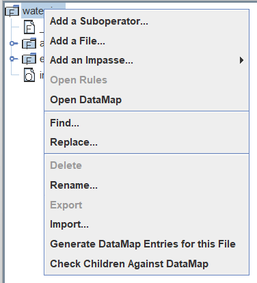

# 教程使用方法

SOAR 官网链接：https://soar.eecs.umich.edu/articles/articles。

SOAR 9.6.0 Tutorial 链接：https://soar.eecs.umich.edu/articles/downloads/soar-suite/228-soar-tutorial-9-6-0。

**教程功能**

1、介绍 Soar 基本运行原理

2、运行 Soar 程序、理解 Soar 程序的运行

3、如何写出自己的 Soar 程序

**使用步骤：**

1、下载 Soar 9.6.0 Tutorial Multi-Platform，解压。

> 路径名中不能有空格和圆括号。

2、读每一章教程。

3、运行教程中的 Soar 程序

windows：运行 `SoarJavaDebugger.bat`。

> 条件：64 位操作系统；安装 jre。

**延伸阅读：**

Soar Mannal

Gentle Introduction to Soar

# Tutorial.1 Simple Agents

## Introduction

Soar 是建立智能系统的统一架构，提供一个固定的计算结构，在这个结构中，知识可以被编码并用来产生追求目标的行为。Soar 在很多方面像一门编程语言，尽管是一门专用的语言。Soar 区别于其他编程语言的点在于，它嵌入了一种特定的理论，这种理论由合适的基本体组成，这些基本体隐含推理、学习、计划和其他一些对于智能行为很有必要的能力。Soar 的目标不是建立一个通用编程语言，某些数学计算过程在 Soar 中很困难或很别扭，这些计算过程更适合在 C, C++ 和 Java 中实现。Soar 适合建立**使用大量知识产生行为、追求目标的、自主的**智能体。

Soar 有独立的编辑器：VisaulSoar。

## Part I: Simple Soar Programs

### 1、安装 Soar

在 教程使用方法 --》 使用步骤 中。

### 2、使用规则建立简单的 Soar Agent

Soar Agent 中所有知识使用 if-then 规则表示。在 Soar 中，规则被称为 production。规则被用来选择和应用到 operator 上。

#### 2.1 创建 Soar Agent 和使用 Soar Debugger 

打开 `SoarJavaDebugger.bat` 启动 Soar，打开的窗口就是 Soar Debugger，如下图所示：

 

> 左侧空白区域：交互窗口，显示调试信息和打印语句。

> 空白区域下方：命令盒，输入命令。

打开 Soar Debugger 后，将自动创建名为 soar1 的默认 agent，其名称显示在窗口标题。

运行 Soar 程序时，可以通过点击按钮或输入命令执行操作，如下所示：


#### 2.2 Hello-World 规则：自然语言方式

使用自然语言书写规则：

​	hello-world:

​	If I exists, then write "Hello World" and halt.

在 Soar 中，if 部分被称为 conditions(条件)，then 部分被称为 actions(行为)。如果规则的 conditions 成立，actions 就会执行，actions 的执行通常会改变 working memory(工作内存) 中的数据，working memory 中保存了 Soar 程序运行所需的所有动态数据。执行规则中的 actions 被称为 fire the rule。Soar 会在 Working Memeory 中进行数据比较，判断 conditions 成立与否。Working Memory 定义了现在的状态，组成了 Agent 对其世界的感知、中间计算的结果、活跃的目标和运算符。


Rule Memory(规则内存)：存储所有规则。长期的知识。

Working Memoty(工作内存)：存储短期数据。

Soar 中的规则是并行匹配和执行的。Working Memory 由单独元素的图结构组成。元素由规则或 sensors(传感器) 创建，Soar 架构也会自动创建有限的工作内存元素。Working Memory 与 Rule Memory 匹配来决定 rule 是否 fire。

#### 2.3 加载并执行 Hello-World

如下图，加载源文件：


如下图，选择 `.soar` 文件：


如下图，点击 "run" 执行：


运行时 Soar 所做的第一件事是自动创建初始状态 S1，Working Memory 全部被组织为 states(状态)。states 和 rule 匹配就会 fire the rule，执行 action。

rule 模板：

```Soar
sp {rule_name
	(condition)
	(condition)
	...
	-->
	(action)
	(action)
...}
```

规则名：数字、字母、`_` 、`-`和 `*`。不使用单字母多数字，如 `O1`。

#### 2.4 Working Memory 工作内存

Working Memory 存储一个 Soar Agent 有关其世界和内部推理的全部动态信息，包含传感器数据、中间计算结果、当前运算符和目标。Soar 中工作内存被组织成有状态的图结构，因此每一个工作内存元素或直接或间接地连接到一个状态标志。

Soar 中有两种结点：identifiers(标识符) 和 constants(常量)。可以从标识符中引出边，标识符为非终端结点；无法从常量引出边，常量是终端结点。所有的标识符由 Soar 创建，格式为 "单个字母+数字"。Soar 中的边被称为 attributes(属性)，属性以 `^` 开头，由于只有标识符有边，因此只有标识符有属性。

案例：使用 Soar 表示如下的情景。


>  S1、B1、B2 和 T1 都是标识符。
>
> ^table、 ^block 等都是属性。
>
> Table、gray、table 等都是常量。

工作内存实际上由单独元素组成，每个单独元素是 identifier(标识符)、attribute(属性)、value(值) 组成的三元组。例如，在下面这张图中。


共有五个单独元素：


这些单独元素就是工作内存的最小内容。

有相同标识符的一组工作内存元素被称为 object(对象)，组成对象的工作内存元素称为 augmentation(增益)。对象通常记为增益的列表，列表首个元素为所有增益共有的标识符，后面依次跟随属性-值。例：上面工作内存的对象为：


工作内存对象通常代表世界上的某样东西，单独的 augmentation 代表属性或与其他对象的关联。

Soar 中不需要对属性或常量进行声明。使用 Soar 的编辑和开发工具 VisualSoar 不需要对工作内存元素的结构进行声明，VisualSoar 只会检查规则中的错误，在运行 Soar 程序时不会使用 VisualSoar。

#### 2.5 Hello-World 规则：Soar 实现细节

每一个 Soar 智能体被创建时，在工作内存中存在：`s1 ^type state`。可以将 ”这个结构存在与否“ 作为判断条件，但 s1 是一个随机的标识，不能直接使用 s1 判断，可以使用变量进行匹配，Soar 中变量的定义方式：`<变量名>`，根据变量所在的位置决定是跟标识符、属性还是值进行匹配。因此判断条件为：

```
<s> ^type state
```

Soar 中每个规则必须以在状态中匹配一个结构作为开始。因此 if 部分：

```
sp {hello-world
	(state <s> ^type state)
-->
	(write | Hello World |)
	(halt)}
```

"|" 用来标识特殊字符常量。可以打印字母和空格。

`halt` 停止智能体。

运行案例：

```
sp {
   hello_world
   (state <s> ^type state)
-->
   (write |Hello,World!|)
   (halt)
}
```

> 注意：路径中不能有中文，否则导入不成功。

#### 2.6 使用 Operators(运算符) 建立简单的智能体

运算符可以执行行为，或在外部世界，或在智能体 “脑中”。

Soar 的基本运行流程：


通过规则提出运算符 --> 选择运算符 --> 通过规则应用运算符 的循环。

**`Proposal` 提出运算符**

在 Soar 中使用运算符之前，首先要通过 `Proposal` 规则在工作内存中进行创建。`Proposal` 规则测试 state(状态) 的特性，保证运算符在此环境下合适，然后就在工作内存中对运算符进行描述并提供一个该运算符的 acceptable preference(可接受优先权)。这个优先权可以告诉 Soar 架构可以选择这个运算符。对于简单的运算符，其在工作内存中的表示通常就是其名，更复杂的运算符可以包含参数的表示。

**运算符的选择与应用**

一旦某个运算符被选择，应用运算符的规则就会匹配并执行行为。如果选中的运算符在工作内存中只使用一个名称来表示，那些仅仅测试名称的规则就会被要求执行运算符。如果运算符已经包含了将发生何种改变的说明，那么可以使用粗泛的规则来使用运算符。因此，工作内存是行为发生的一个中间地点，在其中，运算符被提出、其中一个被选择、规则运用运算符。

### 3、Hello World 运算符

#### 3.1 使用 demo

清除所有规则并初始化 Soar 架构：

```
excise --all
```

加载源文件：

`SoarTutorial_9.6.0-Multiplatform_64bit\agents\hello-world-operator`

> 加载成功后，会提示加载了两个 prodution(规则)，即提出运算符和使用运算符规则。

修改 “查看” 级别：

级别 3 以上可以跟踪规则的触发。使用命令盒的 “Watch 5”，设置最高的 “查看级别”，如下所示：


运行结果如下：

```
run
--- input phase ---
--- propose phase ---
Firing propose*hello-world
(O1 ^name hello-world +)
(S1 ^operator O1 +)
=>WM: (15: S1 ^operator O1 +)
=>WM: (14: O1 ^name hello-world)
--- decision phase ---
=>WM: (16: S1 ^operator O1)
     1: O: O1 (hello-world)
--- apply phase ---
--- Firing Productions (IE) For State At Depth 1 ---
Firing apply*hello-world
Hello World
--- Change Working Memory (IE) ---
Interrupt received.
This Agent halted.

An agent halted during the run.
```


使用 "+" 查看更多细节。

#### 3.2 书写 Hello World 运算符

运算符的提出：

```
sp {propose*hello-world # 提出 hello-world 运算符规则
    (state <s> ^type state) # 检测 <s> ^type state 结构
-->
	# + 表示可供选择
	# 给任意标识符添加运算符
    (<s> ^operator <o> +)
    # 给这个运算符命名为 hello-world
    (<o> ^name hello-world)
}
```

运算符的选择：由于工作内存中只有 hello-world 一个运算符，因此会选择 hello-world 运算符。

运算符的应用：

```
sp {apply*hello-world # 应用 hello-world 运算符规则
    # 检测 标识符 ^operator 值 结构
    (state <s> ^operator <o>)
    # 检测 上述值 ^name hello-world 结构
    (<o> ^name hello-world)
-->
	# 写 Hello World
    (write |Hello World!|)
    # 退出智能体
    (halt)
}
```

运行结果：


#### 3.3 检查工作内存

可以在命令行输入 `print s1` 打印所有以 `s1` 为标识符的属性和值。


窗口右上角也有显示：


如上图所示，属性 `^io`、`^superstate` 和 `^type` 是程序执行前自动创建的。只有被选择的运算符 `^operator` 属性后才没有 “+”。

右击选择，输出以 `I1` 为标识符的属性和值。


`I1` 有两个属性+值：

```
(I1 ^input-link I2 ^output-link I3)
```

### 4、VisualSoar 介绍

Datamap：


### 5、创建智能体解决 Water Jug 问题

#### 5.1 Water Jug 问题

> 有两个水桶，一个能乘 5 升水，一个能乘 3 升水。水井中有无限水。如何在 3 升的水桶中乘 1 升水。

#### 5.2 状态表示

#### 5.3 初始状态创建：初始化 water-jug 运算符

规则名称：`任务名*方法名*运算符名`。

使用 "-" 测试工作内存中是否缺少某个元素。

在 `VisaulSoar` 中，最下部文件就是 `initialize-water-jug`：


自动生成的规则：


```
# 提出 water-jug 任务中 initialize-water-jug 运算符
sp {water-jug*propose*initialize-water-jug
    # 保证规则至少有一种为 positive
    (state <s> ^superstate nil)
    # 没有名字属性
    - (<s> ^ name)
-->
    (<s> ^operator <o> +)
    (<o> ^name initialize-water-jug)
}
```

条件的顺序无关紧要，但第一个条件必须能够成立。

> 可能出现空指针异常？

应用 `initialize-water-jug` 运算符：

```
sp {apply*initialize-water-jug
   (state <s> ^operator <op>)
   (<op> ^name initialize-water-jug)
-->
   # 创建两个 jug j1和 j2
   (<s> ^name water-jug
        ^jug <j1>
        ^jug <j2>)
   # j1 容量为5，已装水0
   (<j1> ^volume 5
         ^contents 0)
   # j2 容量为3，已装水0
   (<j2> ^volume 3
         ^contents 0)
}
```

> Datamap 是 VisualSoar 中用来表示工作内存结构的图形化界面。

打开项目的 Datamap：



如下所示，在根目录下添加标识符，名称为 `jug`：


再给 `jug` 标识符添加三个 `Integer` 属性：contents、empty 和 volume。


Soar 中允许将以标识符相连的条件进行合并，如下：

```
sp {apply*initialize-water-jug
   (state <s> ^operator <op>)
   (<op> ^name initialize-water-jug)
```

转化为：

```
sp {apply*initialize-water-jug
   (state <s> ^operator.name initialize-water-jug)
```

#### 5.4 工作内存元素的持续性(*)

> 问题背景：在 Soar 的大部分规则中，如果在某个状态下，条件匹配，行为就会执行，但如果条件不匹配了，条件匹配情况下生成的结构也会移除，这相当于在脑中推演结果但没有具体实行。下面的规则中
>
> 
>
> 初始化运算符应用过一次后，它在工作内存中就没有用了。将其删除后，上述规则条件便不会匹配，将创建的结构删除，这是不正确的。初始化运算符生成的结构应该持久化。

Soar 将工作内存元素按生成方式进行了区分：运算符应用规则生成方式和其他规则生成方式。一旦运用了运算符，就相当于做出了决定，其生成的结构即使规则条件不再匹配也不会删除；如果没有使用运算符，相当于在脑中进行推演，如果规则条件不匹配，生成的结构会删除。

Soar 自动区分规则是否为运算符应用规则，并将该种规则生成的工作内存元素称为有 `operator-support/o-support`。非运算符应用规则生成的工作内存元素在规则条件不匹配时就会被删除，称这些元素有 `instantiation-support/i-support`。

#### 5.5 water jug state elaboration(状态详细阐述)

在初始化运算符中，每个 `jug` 只有 `volume` 和 `contents` 两个属性，仍然需要第三个属性 `empty`。这个属性可以由 `volumen - contents` 得到，其结构的生成与值的计算便可以放到 state elaboration(状态详细阐述) 规则中进行。这种规则可以使用其他工作内存元素的组合来生成新的结构。state elaboration 规则产生的工作内存元素是 `i-support` 的，因此当规则的条件不匹配时，其产生的工作内存元素会消失。

在 VisaulSoar 中编写生成 `jug` 的 `empty` 属性的规则：

如下，在 elaboration 目录下新建文件：


```
sp {water-jug*elaborate*empty
   # 条件：状态名为 water-jug 并有 jug 属性，jug 有 volume 和 contents 两个属性
   (state <s> ^name water-jug
              ^jug <j>)
   (<j> ^volume <v>
        ^contents <c>)
-->
   # 行为：为 jug 添加 empty属性
   (<j> ^empty (- <v> <c>))
}
```

使用 datamap 进行检查：


规则如果书写无误，将在 feedback 窗口中显示：


