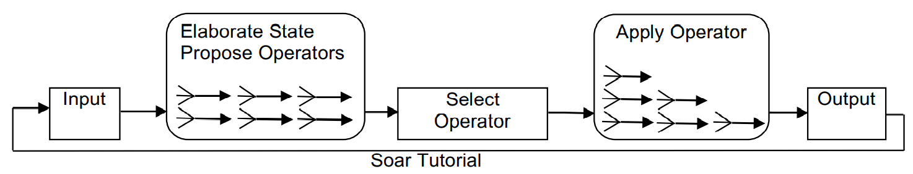

# 一、状态表示

propose initialize operator：

```
sp {water-jug*propose*initialize-water-jug
   # production must have at least one positive condition
   (state <s> ^superstate nil
   # - 检测 working memory elements 的缺失
             -^name)
-->
	# + acceptable preference
   (<s> ^operator <o> +)
   (<o> ^name initialize-water-jug)
}
```

apply initialize operator：

```
sp {water-jug*apply*initialize-water-jug
   (state <s> ^operator <op>)
   (<op> ^name initialize-water-jug)
-->
	# 添加任务名
   (<s> ^name water-jug
        ^jug <j1>
        ^jug <j2>)
    # 添加 jug 结构
   (<j1> ^volume 5
         ^contents 0)
   (<j2> ^volume 3
         ^contents 0)
}
```

使用 Datamap 检查，Datamap 中保存的是边，并不保存结点，因为结点的标识符不确定。

程序一轮执行结果：

```
run 1 --phase
--- propose phase ---
# fire initialize operator
Firing water-jug*propose*initialize-water-jug
Firing elaborate*top-state*top-state
(S1 ^top-state S1 +)
# initialize operator acceptale preference
(O1 ^name initialize-water-jug +)
(S1 ^operator O1 +)
=>WM: (16: S1 ^operator O1 +)
=>WM: (15: S1 ^top-state S1)
=>WM: (14: O1 ^name initialize-water-jug)

run 1 --phase
--- decision phase ---
=>WM: (17: S1 ^operator O1)
     1: O: O1 (initialize-water-jug)
     
run 1 --phase
--- apply phase ---
--- Firing Productions (PE) For State At Depth 1 ---
Firing water-jug*apply*initialize-water-jug
(J2 ^contents 0 + :O)
(J2 ^volume 3 + :O)
(J1 ^contents 0 + :O)
(J1 ^volume 5 + :O)
(S1 ^jug J2 + :O)
(S1 ^jug J1 + :O)
(S1 ^name water-jug + :O)
--- Change Working Memory (PE) ---
=>WM: (24: J2 ^contents 0)
=>WM: (23: J2 ^volume 3)
=>WM: (22: J1 ^contents 0)
=>WM: (21: J1 ^volume 5)
=>WM: (20: S1 ^jug J1)
=>WM: (19: S1 ^jug J2)
=>WM: (18: S1 ^name water-jug)
--- Firing Productions (IE) For State At Depth 1 ---
Retracting water-jug*propose*initialize-water-jug
--> 
(O1 ^name initialize-water-jug +)
(S1 ^operator O1 +)
--- Change Working Memory (IE) ---
<=WM: (16: S1 ^operator O1 +)
<=WM: (17: S1 ^operator O1)
<=WM: (14: O1 ^name initialize-water-jug)
--- Firing Productions (IE) For State At Depth 1 ---
--- Change Working Memory (IE) ---
```

**关键点**：初始化状态完成后，会将 initialize operator 删除，但是由 apply initialize operator 生成的 working memory elements 不会删除。

```
# water-jug*propose*initialize-water-jug 条件已经不满足，retract
Retracting water-jug*propose*initialize-water-jug
--> 
(O1 ^name initialize-water-jug +)
(S1 ^operator O1 +)
--- Change Working Memory (IE) ---
<=WM: (16: S1 ^operator O1 +)
<=WM: (17: S1 ^operator O1)
<=WM: (14: O1 ^name initialize-water-jug)
```

如果 working memory elements 是由于 operator 匹配而生成，并不会因为 apply operator 条件不成立而删除，称这些 working memory elements 为 o-support。

其他  working memory elements 会因为条件不成立导致 retract，从而被删除，称这些 working memory elements 为 i-support。

# 二、State Elaboration

State Elaboration Rule：创建 i-support 的 Working Memory Elements，因此可以不断动态变化。

> Soar 中所有数学符号前置。

使用 Elaboration Rule 不断计算 empty 值。

```
sp {water-jug*elaborate*empty
   (state <s> ^name water-jug
              ^jug <j>)
   (<j> ^volume <v>
        ^contents <c>)
-->
   (<j> ^empty (- <v> <c>))
}
```

程序执行结果：apply phase 阶段

```
--- apply phase ---
...
--- Firing Productions (IE) For State At Depth 1 ---
Firing water-jug*elaborate*empty
Firing water-jug*elaborate*empty
(J2 ^empty 3 +)
(J1 ^empty 5 +)
Retracting water-jug*propose*initialize-water-jug
--> 
(O1 ^name initialize-water-jug +)
(S1 ^operator O1 +)
--- Change Working Memory (IE) ---
=>WM: (26: J2 ^empty 3)
=>WM: (25: J1 ^empty 5)
<=WM: (16: S1 ^operator O1 +)
<=WM: (17: S1 ^operator O1)
<=WM: (14: O1 ^name initialize-water-jug)
--- Firing Productions (IE) For State At Depth 1 ---
--- Change Working Memory (IE) ---
```

Soar 运行循环：



每个阶段静止后进入下一阶段。

# 三、Fill、empty and pour operator

fill-propose：

```
sp {water-jug*propose*fill
   (state <s> ^name water-jug
              ^jug <j>)
   (<j> ^empty > 0)
-->
	# = indifferent preference
	# 如果只使用 +，将形成 tie impasse，无穷无尽地生成子状态
   (<s> ^operator <op> + =)
   (<op> ^name fill
         ^filled-jug <j>)
}
```

fill-apply：

```
sp {water-jug*apply*fill
   (state <s> ^name water-jug
              ^operator <op>
              ^jug <j>)
   (<op> ^name fill
         ^filled-jug <j>)
   (<j> ^contents <c>
        ^volume <v>)
-->
   (<j> ^contents <v>
        ^contents <c> -)
}
```

empty-propose：

```
sp {water-jug*propose*empty
   (state <s> ^name water-jug
              ^jug <j>)
   (<j> ^contents > 0)
-->
   (<s> ^operator <op> + =)
   (<op> ^name empty
         ^emptied-jug <j>)
}
```

empty-apply：

```
sp {water-jug*apply*empty
   (state <s> ^name water-jug
              ^operator <op>
              ^jug <j>)
   (<op> ^name empty
         ^emptied-jug <j>)
   (<j> ^contents <c>)
-->
   (<j> ^contents 0
        ^contents <c> -)
}
```

pour-propose：

```
sp {water-jug*propose*pour
   (state <s> ^name water-jug
              ^jug <i>
              # <j> 与 <i> 不应为同一 identifier
              ^jug {<j> <> <i>})
   (<i> ^contents > 0)
   (<j> ^empty > 0)
-->
   (<s> ^operator <op> + =)
   (<op> ^name pour
         ^emptied-jug <i>
         ^filled-jug <j>)
}
```

pour-apply：有两种情况。

```
# 第一种情况：pour jug contents < fill jug empty
# pour jug contents = 0 fill jug contents = 原 contents + pour jug contents
sp {water-jug*apply*pour*pjcltfje
   (state <s> ^name water-jug
              ^operator <op>)
   (<op> ^name pour
         ^emptied-jug <i>
         ^filled-jug <j>)
   (<i> ^contents <icon>)
   (<j> ^contents <jcon>
        ^empty {<jempty> >= <icon>})
-->
   (<i> ^contents 0)
   (<i> ^contents <icon> -)
   (<j> ^contents (+ <jcon> <icon>))
   (<j> ^contents <jcon> -)
}

# 第二种情况：emptied-jug contents > filled-jug empty
# emptied-jug contents = 原 contents - filled-jug empty filled-jug contents = filled-jug volume
sp {water-jug*apply*pour*ejcgfje
   (state <s> ^name water-jug
              ^operator <op>)
   (<op> ^name pour
         ^emptied-jug <i>
         ^filled-jug <j>)
   (<i> ^contents <icon>)
   (<j> ^empty {<jempty> < <icon>}
        ^contents <jcon>
        ^volume <jvol>)
-->
   (<i> ^contents (- <icon> <jempty>))
   (<i> ^contents <icon> -)
   (<j> ^contents <jvol>)
   (<j> ^contents <jcon> -)
}
```

# 四、Monitor

状态检测：

> 注意：自己写规则时 sp 和 { 之间有空格。

```
sp {water-jug*monitor-state
   (state <s> ^name water-jug
              ^jug <i>
              ^jug <j>)
   (<i> ^volume 3 
         ^contents <icon>)
   (<j> ^volume 5
         ^contents <jcon>)
-->
   (write (crlf) |3 : | <icon> | 5 : | <jcon> |)
}
```

operator 监控：

```
# monitor-state
sp {water-jug*elaborate*monitor-state
   (state <s> ^name water-jug
              ^jug <i> <j>)
   (<i> ^volume 3 ^contents <icon>)
   (<j> ^volume 5 ^contents <jcon>)
-->
   (write (crlf) |current state 3 : | <icon> | 5 : | <jcon> )
}

# monitor-fill
sp {water-jug*elaborate*monitor-fill
   (state <s> ^name water-jug
              ^operator <op>)
   (<op> ^name fill
         ^filled-jug <j>)
   (<j> ^volume <jvol>)
-->
   (write (crlf) |Fill | <jvol>)
}

# monitor-empty
sp {water-jug*elaborate*monitor-empty
   (state <s> ^name water-jug
              ^operator <op>)
   (<op> ^name empty
         ^emptied-jug <j>)
   (<j> ^volume <jvol>)
-->
   (write (crlf) |EMPTY | <jvol>)
}

# monitor-pour
sp {water-jug*elaborate*monitor-pour
   (state <s> ^name water-jug
              ^operator <op>)
   (<op> ^emptied-jug <i>
         ^filled-jug <j>)
   (<i> ^volume <ivol>)
   (<j> ^volume <jvol>)
-->
   (write (crlf) |POUR FROM | <ivol> |TO| <jvol>)
}
```

# 五、目标状态识别

## 1、第一种方式

不断检测是否存在这样的结构。

```
sp {water-jug*elaborate*goal-recognize
   (state <s> ^name water-jug
              ^jug <j>)
   (<j> ^volume 3
        ^contents 1)
-->
   (write |The problem has been solved|)
   (halt)
}
```

五次执行平均值(make decision 次数)：(196 + 85 + 180 + 355 + 116) / 5 = 186.4

## 2、第二种方式

在初始化时建立目标结构，并不断检测是否已经存在目标结构。

建立目标结构

```
# create goal state
sp {water-jug*apply*create-goal-state
   (state <s> ^operator.name initialize-water-jug)
-->
   (<s> ^desired-jug <j>)
   (<j> ^volume 3
        ^contents 1)
}
```

检测目标结构

```
sp {water-jug*elaborate*goal-recognize
   (state <s> ^name water-jug
              ^desired-jug <dj>
              ^jug <j>)
   (<dj> ^volume <v>
         ^contents <c>)
   (<j> ^volume <v>
        ^contents <c>)
-->
   (write |The problem has been solved!|)
   (halt)
}
```

五次执行平均值(make decision 次数)：(360 + 95 + 227 + 223 + 356) / 5 = 252.2

# 六、搜索控制

```
# record last opearator
sp {water-jug*record*last-operator
   (state <s> ^name water-jug
              ^operator <op>)
   (<op> ^name <name>)
-->
   (<s> ^last-operator <lop>)
   (<lop> ^name <name>)
}

# remove last operator
sp {water-jug*remove*last-operator
   (state <s> ^name water-jug
              ^operator <op>
              ^last-operator {<lop> <> <op>})
-->
   (<s> ^last-operator <lop> -)
}

# avoid fill right after empty
sp {water-jug*avoid*fill-right-after-empty
   (state <s> ^name water-jug
              ^last-operator <lop>
              ^operator <op> +)
   (<lop> ^name empty)
   (<op> ^name fill)
-->
   (<s> ^operator <op> <)
}

# avoid empty right after fill
sp {water-jug*avoid*empty-right-after-fill
   (state <s> ^name water-jug
              ^last-operator <lop>
              ^operator <op> +)
   (<lop> ^name fill)
   (<op> ^name empty)
-->
   (<s> ^operator <op> <)
}

# avoid pour right after pour
sp {water-jug*avoid*pour-right-after-pour
   (state <s> ^name water-jug
              ^operator <op> +
              ^last-operator <lop>)
   (<op> ^name pour)
   (<lop> ^name pour)
-->
   (<s> ^operator <op> <)
}

# prefer pour right after fill or empty
sp {water-jug*prefer*pour-right-after-foe
   (state <s> ^name water-jug
              ^operator <op> +
              ^last-operator <lop>)
   (<op> ^name pour)
   (<lop> ^name <<fill empty>>)
-->
   (<s> ^operator <op> >)
}
```

五次执行平均值(make decision 次数)：(253 + 37 + 22 +20 + 217) / 5 = 109.8
